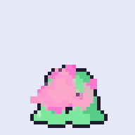
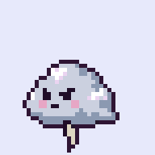
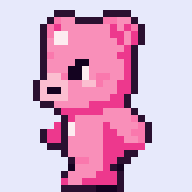
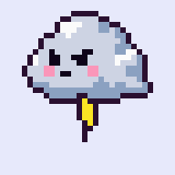
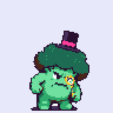
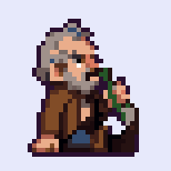
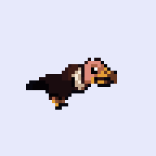
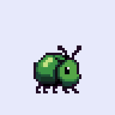
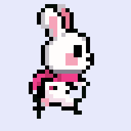

# pixel-video-sprites

**Pixel-perfect sprite animations from a video model.** One native sprite plus one sentence of text in, a finished
pixel animation out – walking, transforming, attacking, wobbling – driven through your own ComfyUI.

Examples from our platformer **KNUDDEL-ALARM**, made from the existing game sprites and used as game assets:

| Jelly gets cured | Storm cloud gets cured | Grumpy bear stomps | Storm cloud strikes | Boss wobbles (64×80) |
|---|---|---|---|---|
|  |  |  |  |  |
| one-shot, 8 frames | one-shot, 6 frames | loop, 6 frames | one-shot, 8 frames | loop, 6 frames |

Each example folder holds the input sprite (`input.png`), the frames as they sit in the game (`frames/`, aligned to one
foot point), a `spritesheet.png`, the `preview.gif` and the exact settings (`recipe.json`). Nothing was touched up by hand.

Early probe animations (the first tests of the chain):

| Drunk drinks | Vulture flies | Beetle explodes | Bunny runs (weak) |
|---|---|---|---|
|  |  |  |  |

The bunny run is kept as an early experiment only: its start image was already weak (ears and scarf hardly readable).

[Deutsch: README.de.md](README.de.md)

## Why a video model

We tried 42 approaches with image models first: per-frame edits, skeletons, silhouettes, run-cycle templates, whole
sprite sheets in one image, SD 1.5/SDXL with ControlNet, FLUX.2 Klein with a walk LoRA. The single frames looked good,
the motion never did. **Image models have no memory across frames**, so every frame is invented anew and the
animation flickers. Templates make motion correct but never general – there is no template for "beetle explodes".

A video model understands any motion and keeps the character stable across frames. It just cannot draw pixels. So the
work is split:

```
your sprite (≤ 64 px)
  └─ bottom-centre on a flat key colour (green / magenta / blue, auto), nearest-upscaled to 384²
      └─ Wan 2.2 I2V A14B: 33 frames, motion from the text
         high-noise stage WITHOUT the lightx2v speed-up LoRA (real CFG 3.5), low-noise stage with it
          └─ pick frames: loop = exactly one motion period, once = spread up to the last visible frame
              └─ Krea 2 Turbo + k2-pixel32 img2img (denoise 0.4), 6 frames per ComfyUI job
                  └─ MiniMax H3 Pixel Art Refiner: exact grid, ONE shared palette for all frames
                      └─ key colour out → frames/, spritesheet.png, preview.gif, meta.json
```

The things that made it work (each one cost us days):

1. **No speed-up LoRA on the high-noise stage.** lightx2v (4 steps) damps motion; legs only shuffle.
2. **Green screen, not white.** White characters on white lose their legs. The key colour is picked automatically.
3. **Sort frames numerically.** `v_0, v_1, v_10, v_11, … v_2` silently shuffles every clip.
4. **Let Krea re-draw, don't rasterise yourself.** Shrinking the video gives mush; Krea + k2-pixel at low denoise keeps
   the pose from the video and gives a clean pixel line. Keep one art pixel at 32 image pixels (2 × 2 Krea tokens).
5. **Lock the palette.** Same palette for all frames (sprite colours + key). For effects (`--no-hold`) the palette
   comes from the video instead.
6. **"Stay as you are" holds big actions back.** For take-offs and explosions use `--no-hold`, a margin and a lighter
   re-draw.

## Installation

1. A running **ComfyUI** (tested: 0.37) with a 24 GB GPU and plenty of RAM (we use an RTX 4090 and 44 GB RAM; Wan 14B
   loads two ~9.7 GB models one after the other).
2. Custom nodes **ComfyUI-GGUF** and **ComfyUI-Krea2-Pixel-Art-Refiner**, and the model files – all listed with links,
   folders and licenses in **[MODELS.md](MODELS.md)**. No weights are included here.
3. This tool (Python ≥ 3.10, needs only numpy and Pillow):

   ```bash
   pip install .            # installs the `pvs` command
   # or without installing: python -m pixel_video_sprites …
   ```

4. Check everything:

   ```bash
   pvs --url http://127.0.0.1:8188 check
   ```

   It lists missing nodes and model files. If a file lives in a subfolder (e.g. `loras/krea2/k2-pixel32.safetensors`)
   it prints the flag to pass, e.g. `--krea lora_dir=krea2/`.

The ComfyUI URL comes from `--url`, else the `COMFY_URL` environment variable, else `http://127.0.0.1:8188`. If your
ComfyUI sits behind a reverse proxy with auth, set `COMFY_AUTH` to `Bearer <token>`, `Basic <base64>` or
`user:password`. Nothing is stored.

## Usage

```bash
pvs animate examples/knuddel-bear-walk/input.png --view "side view facing left" \
  --action "stomps forward grumpily, swinging his short arms, the body bobbing heavily with each step, walking on the spot like on a treadmill" \
  --description "a small grumpy pink gummy bear with a dark plum outline and an angry frown" \
  --mode loop --frames 6 --stabilize scale --out out/bear-walk
```

Output in `out/bear-walk/`: `frames/frame_XX.png` (native size, transparent), `spritesheet.png`, `preview.gif`,
`meta.json` (picked video frames, cycle, settings, timings), plus the intermediate `start.png`, `video/`, `canvas/`, `krea/`.

The other examples:

```bash
# transformation: one-shot, wide margin, only the video frames where the change happens
pvs animate examples/knuddel-jelly-cure/input.png --mode once --margin 8 --no-hold --canvas 24 \
  --view "three-quarter view facing left" --pick 1,2,3,5,7,9,10,11 \
  --description "a grumpy green jelly blob with a shiny highlight, rosy cheeks and an angry little face, dark plum outline" \
  --action "is hit by a burst of pink hearts, spins once, the angry face melts into a happy blushing smile with closed happy eyes and little pink hearts pop around it" \
  --out out/jelly-cure

# attack: sprite palette plus two darker greys, so the cloud keeps its pink cheeks
pvs animate examples/knuddel-cloud-attack/input.png --mode once --margin 6 --no-hold --canvas 24 --seed 5 \
  --view "front view" --pick 4,10,14,18,21,23,25,27 --palette base --extra-colors "96,102,128;128,136,160;255,250,200" \
  --description "a grumpy grey storm cloud with an angry face, rosy cheeks and a small yellow lightning bolt hanging below" \
  --action "gets angry, turns dark grey and shakes, then shoots a big bright yellow zigzag lightning bolt straight down with a white flash" \
  --out out/cloud-attack

# a 64x80 boss: bigger canvas, k2-pixel64 (cell 16)
pvs animate examples/knuddel-baron-dizzy/input.png --canvas 80 --cell 16 --side 480 --seed 5 --frames 6 --view "front view" \
  --description "Baron von Grummelkraut, a big muscular broccoli boss with a dark green crown of florets, a black top hat with a pink band, a golden monocle and a grumpy frown" \
  --action "is dizzy and wobbles like a roly-poly toy, leaning far to the left and then far to the right, the top hat tilting, stars circling around his head" \
  --out out/baron-dizzy

# early probes: one-shot action, a little air around the sprite
pvs animate examples/drunk-drinks/input.png --mode once --margin 2 \
  --description "a scruffy drunk old man with a red nose, stubble, brown coat and blue trousers, sitting on the ground" \
  --action "stays sitting on the ground, slowly lifts the green glass bottle to his mouth, takes a long drink, lowers the bottle again and sways sleepily" \
  --out out/drunk-drinks

# big motion: no "stay as you are", wide margin, longer clip
pvs animate examples/vulture-flies/input.png --mode loop --margin 6 --no-hold --length 49 \
  --description "a scruffy vulture with dark brown feathers, a bald pink head and neck and a hooked yellow beak" \
  --action "spreads its big brown wings wide, jumps up and takes off, then flies with strong wing flaps, the wings beating far up and far down in a steady flight cycle" \
  --out out/vulture-flies

# effect: new colours from the video, lighter re-draw so Krea does not paint the explosion away
pvs animate examples/beetle-explodes/input.png --mode once --margin 8 --no-hold --denoise 0.3 \
  --description "a round shiny green beetle with six short black legs and two antennae" \
  --action "suddenly bursts apart in a big cartoon explosion: the green shell cracks into flying pieces, a bright orange and yellow fireball with sparks, then grey smoke clears and the beetle is gone" \
  --out out/beetle-explodes
```

Each `examples/*/recipe.json` holds the exact settings of the shown result. Results vary with the seed (`--seed`);
make a few and pick one.

### Options

| Option | Default | Meaning |
|---|---|---|
| `--mode loop\|once` | `loop` | `loop` = one motion period (run, fly, idle); `once` = one-shot action (explosion, drinking) |
| `--frames` | 12 | frames to keep (a loop takes the whole period if it is shorter) |
| `--margin` | 0 | extra grid cells of air around the sprite: 2 drinking, 6 wings, 8 explosions |
| `--no-hold` | off | drop "keeps size and proportions", camera follows, palette from the video – for big actions and effects |
| `--denoise` | 0.4 | Krea re-draw strength (0.3 for effects) |
| `--length` | 33 | video frames (4n+1, e.g. 33 or 49) |
| `--side` / `--steps` | 384 / 8 | video resolution and Wan steps (half of them on the high-noise stage with CFG 3.5) |
| `--cell 32\|16` | 32 | Krea cell size: 32 = best look; 16 = k2-pixel64 on a quarter of the pixels, faster but crumbs on effects |
| `--view` | `side view facing right` | must match your sprite (`side view facing left`, `front view`, …) |
| `--canvas` | 32 / 64 | canvas edge in sprite pixels (32 up to 30 px, else 64); `80` with `--cell 16` for a 64×80 boss |
| `--stabilize pos\|scale` | off | calm the picked video frames before the re-draw: foot line and body centre (`pos`), plus height back to the sprite height (`scale`, against Wan zooming on hops) |
| `--pick 1,2,5,…` | auto | your own choice of video frames, e.g. only the part of a one-shot clip where the action happens |
| `--palette base\|video`, `--extra-colors "r,g,b;…"` | base (video with `--no-hold`) | palette source; extra colours for `base`, e.g. darker greys for a cloud that darkens |
| `--wan KEY=VALUE`, `--krea KEY=VALUE` | | override any template parameter (model file names, `shift`, `hi_cfg`, `lora_dir`, …) |

### Python

```python
from pixel_video_sprites import animate
from pixel_video_sprites.comfy import ComfyClient

meta = animate("hero.png", action="jumps high and lands", description="a small knight in blue armour with a red plume",
               out_dir="out/hero-jump", mode="once", margin=4, client=ComfyClient("http://127.0.0.1:8188"))
print(meta["spritesheet"], meta["timing"])
```

## Still images: scenes and sprites

The same models also make still pixel art. Krea 2 paints the picture, the MiniMax H3 refiner collapses it to the exact
grid, so one art pixel is exactly one output pixel:

```bash
# a 384x216 scene, 32 colours (rendered at 4 px per art pixel, no LoRA)
pvs scene "a fairytale castle with red roof towers above a mountain lake at sunset, pine forests" --out out/castle.png
# a 64x64 sprite with transparent background (k2-pixel64; <= 32 px uses k2-pixel32)
pvs sprite "a small red dragon with an orange belly, full body, side view facing right" --size 64 --out out/dragon.png
# a 32x32 icon
pvs sprite "a round glass bottle with glowing red health potion" --size 32 --colors 12 --item --out out/potion.png
```

Write only the subject, without style words – the style prompt is added for you. Sprites come on white; the white
background connected to the border is keyed out (hard alpha). Feed a sprite straight into `pvs animate`. If your LoRAs
live in a subfolder, add `--krea lora_dir=krea2/`. About 20 s per scene and 10 s per sprite on an RTX 4090.

More examples, made with the same models and recipes: [daybun.com/pixel-engine](https://daybun.com/pixel-engine/).

## Workflows

The three ComfyUI workflows are in [`pixel_video_sprites/workflows/`](pixel_video_sprites/workflows/):

* `wan22_i2v_motion.json` – Wan 2.2 I2V A14B, two `KSamplerAdvanced` stages (high noise without lightx2v, low noise with it).
* `krea2_pixel_img2img_batch6.json` – Krea 2 Turbo + k2-pixel img2img as six parallel sampler branches in one job,
  followed by the MiniMax H3 refiner with a shared palette image.
* `krea2_pixel_t2i.json` – Krea 2 Turbo text-to-image (optionally with a k2-pixel LoRA) and the MiniMax H3 refiner
  to an exact grid; used by `pvs scene` and `pvs sprite`.

They are ComfyUI **API-format** workflows with `{{placeholders}}` and a `_template` block listing every parameter and
its default. The CLI fills them; to load one in the ComfyUI editor, replace the placeholders with values first.

## Timings (RTX 4090, shared server)

| Setting | Frames | Video (Wan) | Pixel (Krea) | Total |
|---|---|---|---|---|
| first version: 512², 10 steps, one Krea job per frame | 12 | – | – | ≈ 4.5 min |
| 512², 10 steps, Krea 6 per job | 12 | 63 s | 101 s | 2.7 min |
| **384², 8 steps, Krea 6 per job (default)** | 6 | 45 s | 68 s | 2.1 min |
| **384², 8 steps, Krea 6 per job (default)** | 12 | 46 s | 138 s | 3.1 min |
| 384², 8 steps, `--cell 16` | 6 | 45 s | 29 s | 1.2 min |

Video = compute time on the server; pixel = wall time incl. upload/download; total includes the first model load.

## Limits

* Tuned for native sprites up to 64 px; bigger ones (a 64×80 boss) work with `--canvas 80 --cell 16`. The view (e.g. side view) must already be right in the input.
* Describe the character precisely (colours, clothes), otherwise Krea "corrects" it.
* Not every seed works – generate a few variants and pick one.
* Small wobbles remain (ear shapes, dark lumps on fast wing strokes).
* Video models do not like destroying characters; explosions need a clear action and `--no-hold`.
* The small Wan 2.2 5B (Turbo) model is faster, but in our tests it grew and redesigned the character and froze the pose.

## License

MIT for everything in this repository – see [LICENSE](LICENSE). The models are not part of it and keep their own
licenses (see [MODELS.md](MODELS.md); note the **Krea 2 Community License** before commercial use).

Made by the [Daybun](https://daybun.com) team. Thanks to the authors of Wan 2.2, Krea 2, the k2-pixel LoRAs (e-n-v-y),
the Krea 2 Pixel Art Refiner (envy-ai), ComfyUI-GGUF (city96), the GGUF builds (QuantStack) and the Comfy team.
